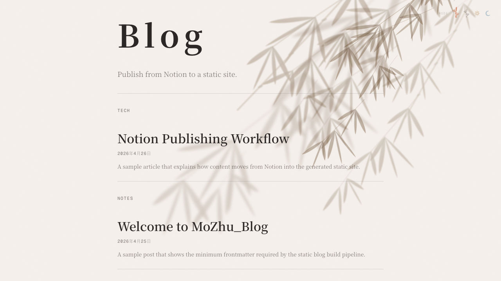

# MoZhu_Blog

一个基于 Notion 作为内容源、纯静态页面作为前端的开源博客项目，同时也可以作为可复用模板继续定制。

## 项目链接

- [minliny/MoZhu_Blog](https://github.com/minliny/MoZhu_Blog)

## 项目截图



## 适用场景

- 想用 Notion 作为博客 CMS
- 想把博客发布到 GitHub Pages
- 想保留纯静态站点的简单部署方式
- 想基于现成仓库快速改造成自己的个人博客

仓库当前实现位于 [blog-frontend](blog-frontend/)，核心流程是：

1. 从 Notion 数据库读取 `Published` 文章
2. 将正文转换为 Markdown 文件写入 `blog-frontend/posts/`
3. 生成 `posts.json` 和 `feed.xml`
4. 通过 GitHub Actions 发布到 GitHub Pages

## 核心功能

- Notion 数据库驱动内容发布
- 仅发布 `Status = Published` 的文章
- `Draft` 状态文章不会进入静态站点
- Notion 正文自动转换为 Markdown 正文
- 生成文章索引 `posts.json`
- 生成 RSS `feed.xml`
- 通过 GitHub Actions 自动构建并部署到 GitHub Pages
- 支持本地静态预览

## 设计说明

本项目的视觉方向、个人博客气质和部分信息结构设计，明确参考了 [xiaogai.fun](https://xiaogai.fun/)。

参考主要体现在以下层面：

- 极简个人博客首页结构
- 首页文章列表 + 文章详情页的双页组织
- 轻量的主题切换体验
- 偏中文写作场景的排版取向

同时，这个仓库在实现方式上做了明确区分，不是对原站点的代码复制：

- 内容来源改为以 Notion 数据库为发布后台
- 通过 Node.js 脚本将 Notion 页面同步为本地 Markdown
- 额外生成 `posts.json` 和 `feed.xml` 作为静态分发产物
- 使用 GitHub Actions 自动构建，并发布到 GitHub Pages
- 仓库结构、同步逻辑、发布链路和开源文档均按模板项目场景重新整理

如果你打算基于本项目继续定制，建议把站点文案、品牌名、配色、页眉页脚信息和示例文章替换为你自己的版本。

## 技术栈

- Node.js 20+
- 原生 HTML / CSS / JavaScript
- [@notionhq/client](https://www.npmjs.com/package/@notionhq/client)
- [gray-matter](https://www.npmjs.com/package/gray-matter)
- [dotenv](https://www.npmjs.com/package/dotenv)
- GitHub Actions
- GitHub Pages

## 项目结构

```text
.
├── .github/workflows/deploy-blog.yml
├── blog-frontend/
│   ├── about.html
│   ├── index.html
│   ├── post.html
│   ├── scripts/
│   │   ├── build.js
│   │   ├── generate-posts.js
│   │   ├── generate-rss.js
│   │   └── sync-notion.js
│   ├── posts/
│   ├── posts.json
│   └── feed.xml
├── docs/
└── examples/
```

## Notion 数据库字段结构

当前项目要求 Notion 数据库包含以下字段：

| 字段名 | 类型 | 说明 |
| --- | --- | --- |
| 名称 | `title` | Notion 数据库默认标题字段 |
| Slug | `rich_text` | URL 和文件名 |
| Status | `select` | 发布状态 |
| Date | `date` | 发布时间 |
| Excerpt | `rich_text` | 摘要 |
| Group | `select` | 分组 |
| Tags | `multi_select` | 标签 |
| Cover | `url` | 封面 |

### Status 选项

- `Draft`
- `Published`

### Group 选项

- `tech`
- `notes`
- `life`

### 发布规则

- `Slug` 推荐使用“日期 + 标题”的格式，例如 `2026-04-26-my-first-post`
- `Draft` 不发布
- `Published` 才发布
- Notion 正文作为博客正文来源

更多字段说明见 [docs/notion-database.md](docs/notion-database.md)。

## 快速开始

### 1. 安装依赖

```bash
cd blog-frontend
npm install
```

### 2. 配置环境变量

复制 [blog-frontend/.env.example](blog-frontend/.env.example) 到 `blog-frontend/.env`，然后填入你自己的配置。

环境变量必须通过 `.env` 或 GitHub Secrets 配置，不要提交真实 Token。

对于当前仓库 `minliny/MoZhu_Blog`，如果你使用 GitHub Pages 默认域名，本地 `.env` 中的 `SITE_URL` 可配置为：

```bash
SITE_URL=https://minliny.github.io/MoZhu_Blog
```

### 3. 从 Notion 同步文章

```bash
cd blog-frontend
npm run sync:notion
```

### 4. 生成静态产物

```bash
cd blog-frontend
npm run build
```

### 5. 本地运行

```bash
cd blog-frontend
npm run serve
```

默认访问地址：

- `http://127.0.0.1:4321/index.html`
- `http://127.0.0.1:4321/post.html?slug=hello-world`

## 环境变量说明

| 变量名 | 必填 | 说明 |
| --- | --- | --- |
| `NOTION_TOKEN` | 是 | Notion Integration Token |
| `NOTION_DATABASE_ID` | 是 | Notion 数据库 ID |
| `SITE_URL` | 是 | 站点公开访问地址，用于 RSS 和绝对链接；当前仓库可使用 `https://minliny.github.io/MoZhu_Blog` |
| `ALLOW_EMPTY_NOTION_SYNC` | 否 | 设为 `1` 时允许数据库为空 |
| `DISABLE_NOTION_SYNC_DELETE` | 否 | 设为 `1` 时禁止删除已不存在于 Notion 发布列表中的本地文章 |
| `GITHUB_TOKEN` | 否 | 仅在你自定义 GitHub API 调用时使用，当前 Actions Pages 部署流程不直接读取该值 |

## 本地运行方式

常用命令：

```bash
cd blog-frontend
npm run sync:notion
npm run build
npm run serve
```

如果只想检查同步结果而不落盘：

```bash
cd blog-frontend
npm run sync:notion:dry
```

## GitHub Actions / 自动发布说明

当前仓库已经包含 GitHub Actions 工作流 [deploy-blog.yml](.github/workflows/deploy-blog.yml)。

真实逻辑如下：

1. 监听 `main` 分支 `push`
2. 在 `blog-frontend/` 下执行 `npm ci`
3. 自动推导 `SITE_URL`
4. 运行 `npm run sync:notion`
5. 运行 `npm run build`
6. 将 `blog-frontend/` 作为 GitHub Pages 构建产物上传并部署

需要在 GitHub 仓库 Secrets 中配置：

- `NOTION_TOKEN`
- `NOTION_DATABASE_ID`

当前仓库部署到 GitHub Pages 后，默认公开地址将是：

- [https://minliny.github.io/MoZhu_Blog](https://minliny.github.io/MoZhu_Blog)

## 部署方式

当前真实已实现部署方式：

- GitHub Pages：已实现
- GitHub Actions 自动部署：已实现
- Vercel：待配置
- Netlify：待配置

详细说明见 [docs/deployment.md](docs/deployment.md)。

## 常见问题

常见问题与排查见：

- [docs/setup.md](docs/setup.md)
- [docs/troubleshooting.md](docs/troubleshooting.md)

## License

本项目使用 MIT License，见 [LICENSE](LICENSE)。
